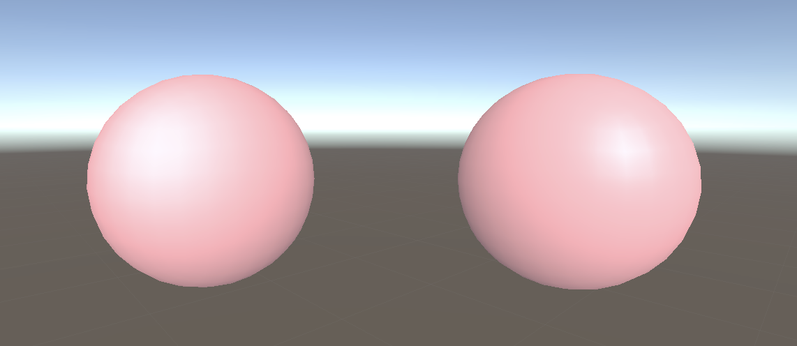

# Unity3D_ShaderPractice

    
A demo show my shader prcatice result

    <h1>Common Effect</h1>
    <h2>Outline Shader - (Assets/Shaders/OutlineSurfaceShader)</h2>
    
    <h3>How to achieve ?</h3>
    
Add a pre-execute pass in front of the main surface shader

    <h3>Properties</h3>
    
    <h1>Basic Light model</h1>
    <h2>Blinn-phong</h2>
    
    <h2>Half lambert</h2>
    

